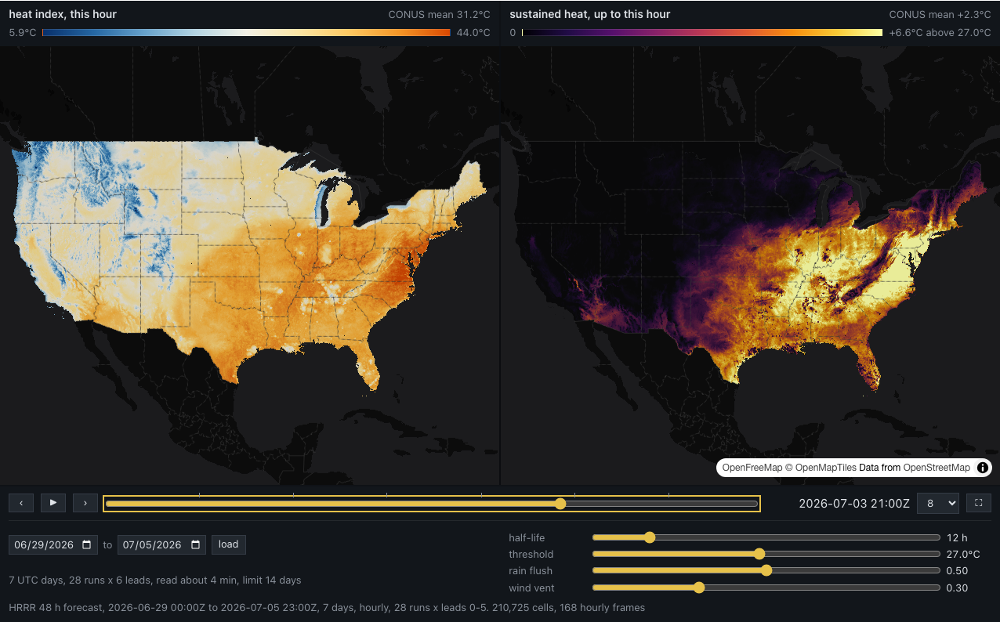

# weather-rnd

[](https://molab.marimo.io/github/github.com/kentstephen/weather-rnd/blob/main/heat-pair.py)

## `heat-pair.py`: heat index and sustained heat, side by side

A [marimo](https://marimo.io) notebook. Two maps of the lower 48 on H3 res 6 hexagons
(about 210,000 cells), one camera, one clock.



- **Left: the heat index this hour.** NWS heat index from each cell's hourly mean 2 m
  temperature and relative humidity.
- **Right: sustained heat up to this hour.** An exponentially weighted moving average
  of the heat index's excess over a threshold, decaying with a half-life you set:
  what the last days of heat have left behind in each cell. A place whose nights do
  not cool stays bright after the sun goes down.

Press play and both run together. Drag or zoom either map and the other follows.
Hover a cell on either map and it is ringed on both; click it and its two lines over
the week are drawn under the maps. Double click a slider to put it back where it
started. The opening window is 29 June to 5 July 2026, the week of July 4, when the
eastern heat dome peaked.

Both formulas are written out in the notebook's first cell. In short:

```
heat index      Steadman's simple form, replaced by the Rothfusz regression (with the
                two NWS humidity adjustments) once the mean of it and T reaches 80 F

sustained heat  a   = 2^(-1 / half_life)
                e_t = max(0, HI_t - threshold) * max(0, 1 - vent * wind_t / 10)
                L_t = (a * L_(t-1) + (1 - a) * e_t) * (1 - flush * min(1, rain_t / 2.5))
```

Sustained heat is a smoothing with stated parameters, not a published index. The
sliders are the parameters.

## Data

[dynamical.org](https://dynamical.org/)'s Zarr build of NOAA's HRRR 48-hour forecast
(3 km, CONUS, CC-BY 4.0), read anonymously from
[source.coop](https://source.coop/dynamical). A week is stitched from the first six
lead hours of every 00/06/12/18Z run inside it. The store is queried with
[xarray-sql](https://github.com/alxmrs/xarray-sql); each pixel is labelled with its H3
cell inside the DataFusion `GROUP BY` (h3ronpy). Counties for the land mask come from
Overture Maps' PMTiles (the newest release in Overture's tiles bucket, resolved when the
notebook starts). Nothing is precomputed: the first open of a week reads 28 runs
x 5 variables over the wire (about six minutes from a home link, much less near the
bucket in us-west-2), and `join/hrrr_mirror.py` keeps the bytes on disk so the next
open of the same week does not.

The map is deck.gl's `H3HexagonLayer` interleaved into two maplibre maps (OpenFreeMap
dark) inside one anywidget. The clock, the accumulator, the picking and the charts all
run in the browser.

## Run it

```
uv sync
uv run marimo edit heat-pair.py
```

or, without the project, `uvx marimo edit --sandbox heat-pair.py` (the notebook carries
its own dependency header). `fly_heat.py` is a headless flight of the notebook with
playwright (`uv sync --group dev`, `uv run playwright install chromium`).
